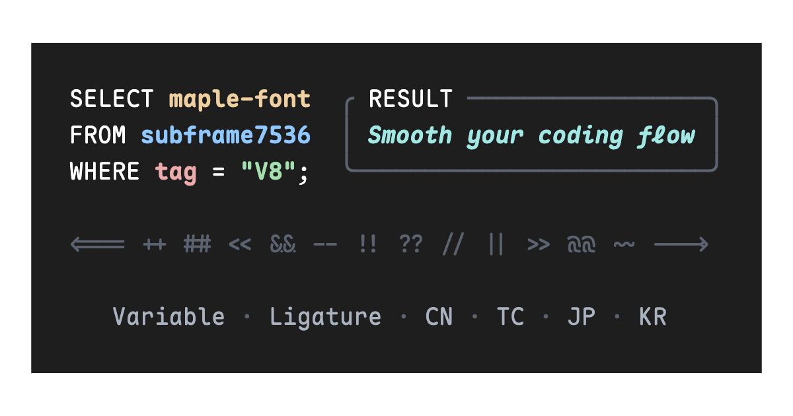
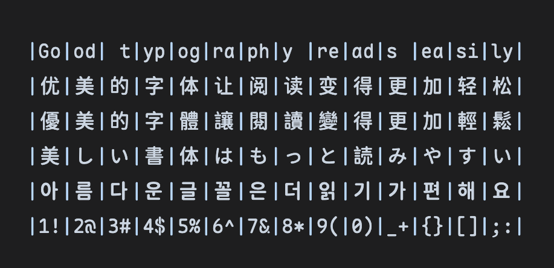
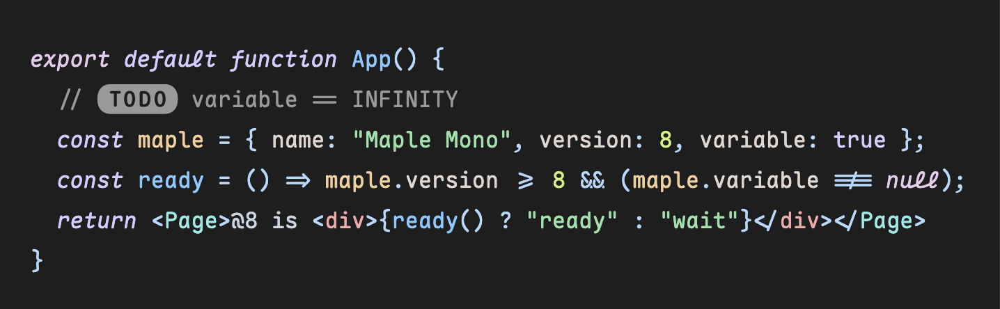

<p align="center">
  <a href="https://trendshift.io/repositories/13165" target="_blank"></a>
  <a href="https://hellogithub.com/repository/0601f355bd824d88b58f1af3066c486a" target="_blank"></a>
</p>
<p align="center">
  
  
  
</p>
<p align="center">
  
  
  
  
</p>

<p align="center">
  <a href="#download">Download</a> |
  <a href="https://font.subf.dev">Website</a> |
  English |
  <a href="./README_CN.md">中文</a> |
  <a href="./README_JP.md">日本語</a> |
  <a href="./README_TC.md">繁中</a> |
  <a href="./README_KR.md">한국어</a>
</p>

# Maple Mono

Maple Mono is an open source monospace font focused on smoothing your coding flow.

I created it to enhance my working experience, and hope that it can be useful to others.

V8 is the next development version of Maple Mono. It expands the CJK build from one CN profile to CN, TC, JP, and KR profiles, adds more Unicode coverage, and will merge into the `variable` branch before release. V7.9 remains the current stable release.

> [!WARNING]
> V8 is still under development and has not been released yet. The latest GitHub release and all current package-manager and CDN packages provide **v7.9**. Use the installation commands below for the stable version; use the source-build instructions only when you want to test V8. Output names and build options may change before V8 is released.

## Features

### Typography

- Variable weight axis with fine-grained italic glyphs.
- Rounded shapes, redesigned `@ $ % & Q ->`, and cursive italic `f i j k l x y`.
- Three Latin width presets: default, narrow, and slim.

### Ligatures and character variants

- Smart programming ligatures, including status labels such as `[DEBUG]`, `[TODO]`, and `[SUCCESS]`, plus infinite arrow ligatures.
- Character variants and stylistic sets cover common coding preferences, including the tailless `u`, longer `|`, and Bulgarian/Serbian Cyrillic variants (`cv12`, `cv45`, `cv67`, `ss12`, `ss13`).
- Full feature descriptions and previews are in [`source/features/README.md`](./source/features/README.md).

### Unicode and integrations

- Broad mathematical coverage (U+2200–U+22FF), superscripts and subscripts, chess and card symbols, and terminal progress/status symbols.
- First-class [Nerd Font](https://github.com/ryanoasis/nerd-fonts) output for terminal icons.
- Feature freezing and custom OpenType generation for reproducible builds.

### CJK extended fonts

V8 can merge Maple Mono with four locale-specific CJK bases. Every locale supports both static and variable output, and the default CJK glyphs use a 2:1 CJK-to-Latin advance width for aligned multilingual text and Markdown tables.

| Locale | Coverage | CJK source | Build output |
| --- | --- | --- | --- |
| CN | Simplified Chinese, with common Traditional Chinese and Japanese ranges | [WenYuan Rounded SC](https://github.com/takushun-wu/WenYuanFonts) | `CN` |
| TC | Traditional Chinese | [Chiron Go Round TC](https://github.com/chiron-fonts/chiron-go-round-tc) | `TC` |
| JP | Japanese | [Resource Han Rounded JP](https://github.com/CyanoHao/Resource-Han-Rounded) | `JP` |
| KR | Korean | [Chiron Go Round TC](https://github.com/chiron-fonts/chiron-go-round-tc), filtered to KR ranges | `KR` |

The CJK build is disabled by default. Use the [CJK build instructions](#cjk-extended-version) to select locales, static or variable output, and optional narrow spacing.



## ScreenShots



- Pictured by [CodeImg](https://github.com/subframe7536/vscode-codeimg)
- Theme: [Maple](https://github.com/subframe7536/vscode-theme-maple)
- Config: font size 16px, line height 1.8, default letter spacing

## Download

Choose the stable v7.9 package that matches your editor or terminal. You can download the same v7.9 archives from [GitHub Releases](https://github.com/subframe7536/maple-font/releases), or use one of the package managers below. These package-manager and CDN commands do **not** install the unreleased V8 CJK profiles.

| Need | Recommended package |
| --- | --- |
| General coding | Maple Mono TTF (hinted for low-resolution screens, unhinted for high-resolution screens) |
| Terminal icons | Maple Mono NF |
| Chinese/Japanese glyphs | Maple Mono CN or Maple Mono NF CN |
| Continuous weight axis | Maple Mono Variable; V8 CJK variable builds require the source build described below |

### Scoop (Windows)

```sh
# Add bucket
scoop bucket add nerd-fonts
# Maple Mono (ttf format)
scoop install Maple-Mono
# Maple Mono NF
scoop install Maple-Mono-NF
# Maple Mono NF CN
scoop install Maple-Mono-NF-CN
```

<details>
  <summary>All packages (Click to expand)</summary>

  ```sh
  # Add bucket
  scoop bucket add nerd-fonts
  # Maple Mono (ttf format)
  scoop install Maple-Mono
  # Maple Mono (hinted ttf format)
  scoop install Maple-Mono-autohint
  # Maple Mono (otf format)
  scoop install Maple-Mono-otf
  # Maple Mono NF
  scoop install Maple-Mono-NF
  # Maple Mono NF CN
  scoop install Maple-Mono-NF-CN
  ```

</details>

### Homebrew (MacOS, Linux)

```sh
# Maple Mono
brew install --cask font-maple-mono
# Maple Mono NF
brew install --cask font-maple-mono-nf
# Maple Mono NF CN
brew install --cask font-maple-mono-nf-cn
```

<details>
  <summary>All packages (Click to expand)</summary>

  ```sh
  # Maple Mono
  brew install --cask font-maple-mono
  # Maple Mono NF
  brew install --cask font-maple-mono-nf
  # Maple Mono CN
  brew install --cask font-maple-mono-cn
  # Maple Mono NF CN
  brew install --cask font-maple-mono-nf-cn

  # Maple Mono Normal
  brew install --cask font-maple-mono-normal
  # Maple Mono Normal NF
  brew install --cask font-maple-mono-normal-nf
  # Maple Mono Normal CN
  brew install --cask font-maple-mono-normal-cn
  # Maple Mono Normal NF CN
  brew install --cask font-maple-mono-normal-nf-cn
  ```

</details>

### Arch Linux

ArchLinuxCN repository allows downloading a single package zip file without downloading all the package zip files in pkgbase, but AUR does not. (If you have a good solution, please contact Cyberczy(czysheep@gmail.com))

#### ArchLinuxCN (Recommended)

```sh
# Maple Mono (Ligature TTF unhinted)
paru -S ttf-maplemono
# Maple Mono NF (Ligature unhinted)
paru -S ttf-maplemono-nf-unhinted
# Maple Mono NF CN (Ligature unhinted)
paru -S ttf-maplemono-nf-cn-unhinted
```

<details>
  <summary>All packages (Click to expand)</summary>

  ```sh
  # Maple Mono (Ligature Variable)
  paru -S ttf-maplemono-variable
  # Maple Mono (Ligature TTF hinted)
  paru -S ttf-maplemono-autohint
  # Maple Mono (Ligature TTF unhinted)
  paru -S ttf-maplemono
  # Maple Mono (Ligature OTF)
  paru -S otf-maplemono
  # Maple Mono (Ligature WOFF2)
  paru -S woff2-maplemono
  # Maple Mono NF (Ligature hinted)
  paru -S ttf-maplemono-nf
  # Maple Mono NF (Ligature unhinted)
  paru -S ttf-maplemono-nf-unhinted
  # Maple Mono CN (Ligature hinted)
  paru -S ttf-maplemono-cn
  # Maple Mono CN (Ligature unhinted)
  paru -S ttf-maplemono-cn-unhinted
  # Maple Mono NF CN (Ligature hinted)
  paru -S ttf-maplemono-nf-cn
  # Maple Mono NF CN (Ligature unhinted)
  paru -S ttf-maplemono-nf-cn-unhinted

  # Maple Mono (No-Ligature Variable)
  paru -S ttf-maplemononl-variable
  # Maple Mono (No-Ligature TTF hinted)
  paru -S ttf-maplemononl-autohint
  # Maple Mono (No-Ligature TTF unhinted)
  paru -S ttf-maplemononl
  # Maple Mono (No-Ligature OTF)
  paru -S otf-maplemononl
  # Maple Mono (No-Ligature WOFF2)
  paru -S woff2-maplemononl
  # Maple Mono NF (No-Ligature hinted)
  paru -S ttf-maplemononl-nf
  # Maple Mono NF (No-Ligature unhinted)
  paru -S ttf-maplemononl-nf-unhinted
  # Maple Mono CN (No-Ligature hinted)
  paru -S ttf-maplemononl-cn
  # Maple Mono CN (No-Ligature unhinted)
  paru -S ttf-maplemononl-cn-unhinted
  # Maple Mono NF CN (No-Ligature hinted)
  paru -S ttf-maplemononl-nf-cn
  # Maple Mono NF CN (No-Ligature unhinted)
  paru -S ttf-maplemononl-nf-cn-unhinted

  # Maple Mono Normal (Ligature Variable)
  paru -S ttf-maplemononormal-variable
  # Maple Mono Normal (Ligature TTF hinted)
  paru -S ttf-maplemononormal-autohint
  # Maple Mono Normal (Ligature TTF unhinted)
  paru -S ttf-maplemononormal
  # Maple Mono Normal (Ligature OTF)
  paru -S otf-maplemononormal
  # Maple Mono Normal (Ligature WOFF2)
  paru -S woff2-maplemononormal
  # Maple Mono Normal NF (Ligature hinted)
  paru -S ttf-maplemononormal-nf
  # Maple Mono Normal NF (Ligature unhinted)
  paru -S ttf-maplemononormal-nf-unhinted
  # Maple Mono Normal CN (Ligature hinted)
  paru -S ttf-maplemononormal-cn
  # Maple Mono Normal CN (Ligature unhinted)
  paru -S ttf-maplemononormal-cn-unhinted
  # Maple Mono Normal NF CN (Ligature hinted)
  paru -S ttf-maplemononormal-nf-cn
  # Maple Mono Normal NF CN (Ligature unhinted)
  paru -S ttf-maplemononormal-nf-cn-unhinted

  # Maple Mono Normal (No-Ligature Variable)
  paru -S ttf-maplemononormalnl-variable
  # Maple Mono Normal (No-Ligature TTF hinted)
  paru -S ttf-maplemononormalnl-autohint
  # Maple Mono Normal (No-Ligature TTF unhinted)
  paru -S ttf-maplemononormalnl
  # Maple Mono Normal (No-Ligature OTF)
  paru -S otf-maplemononormalnl
  # Maple Mono Normal (No-Ligature WOFF2)
  paru -S woff2-maplemononormalnl
  # Maple Mono Normal NF (No-Ligature hinted)
  paru -S ttf-maplemononormalnl-nf
  # Maple Mono Normal NF (No-Ligature unhinted)
  paru -S ttf-maplemononormalnl-nf-unhinted
  # Maple Mono Normal CN (No-Ligature hinted)
  paru -S ttf-maplemononormalnl-cn
  # Maple Mono Normal CN (No-Ligature unhinted)
  paru -S ttf-maplemononormalnl-cn-unhinted
  # Maple Mono Normal NF CN (No-Ligature hinted)
  paru -S ttf-maplemononormalnl-nf-cn
  # Maple Mono Normal NF CN (No-Ligature unhinted)
  paru -S ttf-maplemononormalnl-nf-cn-unhinted
  ```

</details>

#### AUR (Not Recommended)

```sh
# Maple Mono (Ligature TTF unhinted)
paru -S maplemono-ttf
# Maple Mono NF (Ligature unhinted)
paru -S maplemono-nf-unhinted
# Maple Mono NF CN (Ligature unhinted)
paru -S maplemono-nf-cn-unhinted
```

<details>
  <summary>All packages (Click to expand)</summary>

  ```sh
  # Maple Mono (Ligature Variable)
  paru -S maplemono-variable
  # Maple Mono (Ligature TTF hinted)
  paru -S maplemono-ttf-autohint
  # Maple Mono (Ligature TTF unhinted)
  paru -S maplemono-ttf
  # Maple Mono (Ligature OTF)
  paru -S maplemono-otf
  # Maple Mono (Ligature WOFF2)
  paru -S maplemono-woff2
  # Maple Mono NF (Ligature hinted)
  paru -S maplemono-nf
  # Maple Mono NF (Ligature unhinted)
  paru -S maplemono-nf-unhinted
  # Maple Mono CN (Ligature hinted)
  paru -S maplemono-cn
  # Maple Mono CN (Ligature unhinted)
  paru -S maplemono-cn-unhinted
  # Maple Mono NF CN (Ligature hinted)
  paru -S maplemono-nf-cn
  # Maple Mono NF CN (Ligature unhinted)
  paru -S maplemono-nf-cn-unhinted

  # Maple Mono (No-Ligature Variable)
  paru -S maplemononl-variable
  # Maple Mono (No-Ligature TTF hinted)
  paru -S maplemononl-ttf-autohint
  # Maple Mono (No-Ligature TTF unhinted)
  paru -S maplemononl-ttf
  # Maple Mono (No-Ligature OTF)
  paru -S maplemononl-otf
  # Maple Mono (No-Ligature WOFF2)
  paru -S maplemononl-woff2
  # Maple Mono NF (No-Ligature hinted)
  paru -S maplemononl-nf
  # Maple Mono NF (No-Ligature unhinted)
  paru -S maplemononl-nf-unhinted
  # Maple Mono CN (No-Ligature hinted)
  paru -S maplemononl-cn
  # Maple Mono CN (No-Ligature unhinted)
  paru -S maplemononl-cn-unhinted
  # Maple Mono NF CN (No-Ligature hinted)
  paru -S maplemononl-nf-cn
  # Maple Mono NF CN (No-Ligature unhinted)
  paru -S maplemononl-nf-cn-unhinted

  # Maple Mono Normal (Ligature Variable)
  paru -S maplemononormal-variable
  # Maple Mono Normal (Ligature TTF hinted)
  paru -S maplemononormal-ttf-autohint
  # Maple Mono Normal (Ligature TTF unhinted)
  paru -S maplemononormal-ttf
  # Maple Mono Normal (Ligature OTF)
  paru -S maplemononormal-otf
  # Maple Mono Normal (Ligature WOFF2)
  paru -S maplemononormal-woff2
  # Maple Mono Normal NF (Ligature hinted)
  paru -S maplemononormal-nf
  # Maple Mono Normal NF (Ligature unhinted)
  paru -S maplemononormal-nf-unhinted
  # Maple Mono Normal CN (Ligature hinted)
  paru -S maplemononormal-cn
  # Maple Mono Normal CN (Ligature unhinted)
  paru -S maplemononormal-cn-unhinted
  # Maple Mono Normal NF CN (Ligature hinted)
  paru -S maplemononormal-nf-cn
  # Maple Mono Normal NF CN (Ligature unhinted)
  paru -S maplemononormal-nf-cn-unhinted

  # Maple Mono Normal (No-Ligature Variable)
  paru -S maplemononormalnl-variable
  # Maple Mono Normal (No-Ligature TTF hinted)
  paru -S maplemononormalnl-ttf-autohint
  # Maple Mono Normal (No-Ligature TTF unhinted)
  paru -S maplemononormalnl-ttf
  # Maple Mono Normal (No-Ligature OTF)
  paru -S maplemononormalnl-otf
  # Maple Mono Normal (No-Ligature WOFF2)
  paru -S maplemononormalnl-woff2
  # Maple Mono Normal NF (No-Ligature hinted)
  paru -S maplemononormalnl-nf
  # Maple Mono Normal NF (No-Ligature unhinted)
  paru -S maplemononormalnl-nf-unhinted
  # Maple Mono Normal CN (No-Ligature hinted)
  paru -S maplemononormalnl-cn
  # Maple Mono Normal CN (No-Ligature unhinted)
  paru -S maplemononormalnl-cn-unhinted
  # Maple Mono Normal NF CN (No-Ligature hinted)
  paru -S maplemononormalnl-nf-cn
  # Maple Mono Normal NF CN (No-Ligature unhinted)
  paru -S maplemononormalnl-nf-cn-unhinted
  ```

</details>

### Nixpkgs (NixOS, Linux, MacOS)

```nix
fonts.packages = with pkgs; [
  # Maple Mono (Ligature TTF unhinted)
  maple-mono.truetype
  # Maple Mono NF (Ligature unhinted)
  maple-mono.NF-unhinted
  # Maple Mono NF CN (Ligature unhinted)
  maple-mono.NF-CN-unhinted
];
```

<details>
  <summary>All packages (Click to expand)</summary>

  ```nix
  fonts.packages = with pkgs; [
    # Maple Mono (Ligature Variable)
    maple-mono.variable
    # Maple Mono (Ligature TTF hinted)
    maple-mono.truetype-autohint
    # Maple Mono (Ligature TTF unhinted)
    maple-mono.truetype
    # Maple Mono (Ligature OTF)
    maple-mono.opentype
    # Maple Mono (Ligature WOFF2)
    maple-mono.woff2
    # Maple Mono NF (Ligature hinted)
    maple-mono.NF
    # Maple Mono NF (Ligature unhinted)
    maple-mono.NF-unhinted
    # Maple Mono CN (Ligature hinted)
    maple-mono.CN
    # Maple Mono CN (Ligature unhinted)
    maple-mono.CN-unhinted
    # Maple Mono NF CN (Ligature hinted)
    maple-mono.NF-CN
    # Maple Mono NF CN (Ligature unhinted)
    maple-mono.NF-CN-unhinted

    # Maple Mono (No-Ligature Variable)
    maple-mono.NL-Variable
    # Maple Mono (No-Ligature TTF hinted)
    maple-mono.NL-TTF-AutoHint
    # Maple Mono (No-Ligature TTF unhinted)
    maple-mono.NL-TTF
    # Maple Mono (No-Ligature OTF)
    maple-mono.NL-OTF
    # Maple Mono (No-Ligature WOFF2)
    maple-mono.NL-Woff2
    # Maple Mono NF (No-Ligature hinted)
    maple-mono.NL-NF
    # Maple Mono NF (No-Ligature unhinted)
    maple-mono.NL-NF-unhinted
    # Maple Mono CN (No-Ligature hinted)
    maple-mono.NL-CN
    # Maple Mono CN (No-Ligature unhinted)
    maple-mono.NL-CN-unhinted
    # Maple Mono NF CN (No-Ligature hinted)
    maple-mono.NL-NF-CN
    # Maple Mono NF CN (No-Ligature unhinted)
    maple-mono.NL-NF-CN-unhinted

    # Maple Mono Normal (Ligature Variable)
    maple-mono.Normal-Variable
    # Maple Mono Normal (Ligature TTF hinted)
    maple-mono.Normal-TTF-AutoHint
    # Maple Mono Normal (Ligature TTF unhinted)
    maple-mono.Normal-TTF
    # Maple Mono Normal (Ligature OTF)
    maple-mono.Normal-OTF
    # Maple Mono Normal (Ligature WOFF2)
    maple-mono.Normal-Woff2
    # Maple Mono Normal NF (Ligature hinted)
    maple-mono.Normal-NF
    # Maple Mono Normal NF (Ligature unhinted)
    maple-mono.Normal-NF-unhinted
    # Maple Mono Normal CN (Ligature hinted)
    maple-mono.Normal-CN
    # Maple Mono Normal CN (Ligature unhinted)
    maple-mono.Normal-CN-unhinted
    # Maple Mono Normal NF CN (Ligature hinted)
    maple-mono.Normal-NF-CN
    # Maple Mono Normal NF CN (Ligature unhinted)
    maple-mono.Normal-NF-CN-unhinted

    # Maple Mono Normal (No-Ligature Variable)
    maple-mono.NormalNL-Variable
    # Maple Mono Normal (No-Ligature TTF hinted)
    maple-mono.NormalNL-TTF-AutoHint
    # Maple Mono Normal (No-Ligature TTF unhinted)
    maple-mono.NormalNL-TTF
    # Maple Mono Normal (No-Ligature OTF)
    maple-mono.NormalNL-OTF
    # Maple Mono Normal (No-Ligature WOFF2)
    maple-mono.NormalNL-Woff2
    # Maple Mono Normal NF (No-Ligature hinted)
    maple-mono.NormalNL-NF
    # Maple Mono Normal NF (No-Ligature unhinted)
    maple-mono.NormalNL-NF-unhinted
    # Maple Mono Normal CN (No-Ligature hinted)
    maple-mono.NormalNL-CN
    # Maple Mono Normal CN (No-Ligature unhinted)
    maple-mono.NormalNL-CN-unhinted
    # Maple Mono Normal NF CN (No-Ligature hinted)
    maple-mono.NormalNL-NF-CN
    # Maple Mono Normal NF CN (No-Ligature unhinted)
    maple-mono.NormalNL-NF-CN-unhinted
  ];
  ```

</details>

## CDN

The CDN links below distribute the stable **v7.9** fonts. They do not provide the unreleased V8 CJK profiles.

### Maple Mono

- [fontsource](https://fontsource.org/fonts/maple-mono)
- [ZeoSeven Fonts](https://fonts.zeoseven.com/items/443/)

### Maple Mono CN (v7.9)

- [The Chinese Web Fonts Plan (中文网字计划)](https://chinese-font.netlify.app/zh-cn/fonts/maple-mono-cn/MapleMono-CN-Regular)
- [ZeoSeven Fonts](https://fonts.zeoseven.com/items/442/)

## Usage & Feature Configurations

See in [document](./source/features/README.md) or try it in [Playground](https://font.subf.dev/en/playground)

## Naming FAQ

### Features

- **Ligature**: Default version with ligatures (`Maple Mono`)
- **No-Ligature**: Default version without ligatures (`Maple Mono NL`)
- **Normal-Ligature**: [`--normal` preset](#preset) with ligatures (`Maple Mono Normal`)
- **Normal-No-Ligature**: [`--normal` preset](#preset) without ligatures (`Maple Mono Normal NL`)

### Format and Glyph Set

- **Variable**: Minimal version, smoothly change font weight by variable
- **TTF**: Minimal version, ttf format [Recommend!]
- **OTF**: Minimal version, otf format
- **WOFF2**: Minimal version, woff2 format, for small size on web pages
- **NF**: Nerd-Font patched version, add icons for terminal (With `-NF` suffix)
- **CN / TC / JP / KR**: V8 CJK profiles for Simplified Chinese, Traditional Chinese, Japanese, and Korean (with the corresponding suffix)
- **NF-CN / NF-TC / NF-JP / NF-KR**: CJK profiles with Nerd Font icons
- **VF**: Variable-font archive suffix used by release packages; a CJK variable output directory uses `Variable-<LOCALE>`

### Font Hint

- **Hinted font** is used for low resolution screen to have a better rendering effect. From my experience, if your screen resolution is equal to or lower than 1080P, it is recommended to use "hinted font". Using an "unhinted font" will lead to misalignment or uneven thickness on your text.
  - In this case, you can choose `MapleMono-TTF-AutoHint` / `MapleMono-NF` / `MapleMono-NF-CN`, etc.
- **Unhinted font** is used for high resolution screen (e.g., for MacBook). Using "hinted font" will blur your text or make it look weird.
  - In this case, you can choose `MapleMono-OTF` / `MapleMono-TTF` / `MapleMono-NF-unhinted` / `MapleMono-NF-CN-unhinted`, etc.
- Why are there both `-AutoHint` and `-unhinted` suffixes?
  - for backward compatibility, I keep the original naming scheme. `-AutoHint` is only used for `TTF` format.

## Custom Build

The [`config.json`](./config.json) file configures the build process. Check the [schema](./source/schema.json) and [feature documentation](./source/features/README.md) for the complete configuration surface.

CLI options override `config.json`. Run `python build.py --help` after installing dependencies to see the current options.

### Build Methods

#### 1. Build In Browser

Go to [Playground](https://font.subf.dev/en/playground), and click the "Custom Build" button in the bottom left corner

- Only supports freezing OpenType features currently.

#### 2. Use GitHub Actions

You can use [Github Actions](https://github.com/subframe7536/maple-font/actions/workflows/custom.yml) to build the font.

1. Fork the repo.
2. (Optional) Change the content in `config.json`.
3. Go to the Actions tab.
4. Click on the `Custom Build` menu item on the left.
5. Click on the `Run workflow` button with options set.
6. Wait for the build to finish.
7. Download the font archives from Releases.

#### 3. Use Docker

```shell
git clone https://github.com/subframe7536/maple-font --depth 1 -b variable
docker build -t maple-font .
docker run -v "$(pwd)/fonts:/app/fonts" -e BUILD_ARGS="--normal" maple-font
```

#### 4. Local Build (V8 development)

V8 is currently available from the `variable` branch. Make sure you have Python 3.10+ and `pip` installed.

```shell
git clone https://github.com/subframe7536/maple-font --depth 1 -b variable
cd maple-font
pip install -r requirements.txt
python build.py
```

> [!TIP]
> For `Ubuntu` or `Debian`, maybe `python-is-python3` is needed as well.
>
> If you have trouble installing the dependencies, just create a new GitHub Codespace and run the commands there.

The commands above build the development version and write generated fonts under `fonts/`. They do not replace the v7.9 packages already installed by Scoop, Homebrew, Arch, Nix, or a CDN.

### Narrow Glyph Width

You can set `"width": "narrow"` in `config.json` or add `--width slim` as a cli flag to change glyph width at build time.

There are 3 options:
- default: 600
- narrow: 550
- slim: 500

Preview: [#131](https://github.com/subframe7536/maple-font/issues/131#issuecomment-3678666194)

### Custom Nerd-Font

If you want to get fixed-width icons, set `"nerd_font.mono": true` in `config.json` or add `--nf-mono` flag to build script args.

If you want to get variable-width icons, set `"nerd_font.propo": true` in `config.json` or add `--nf-propo` flag to build script args.

If you want a variable Nerd Font, set `"nerd_font.variable": true` in `config.json` or add `--nf-variable` to build script args. This switches the NF output to `Variable-NF`; the release archive is named `NF-VF`.

For custom `font-patcher` args, `font-forge` (and maybe `python3-fontforge` as well) is required.

Maybe you should also change `"nerd_font.extra_args"` in [config.json](./config.json)

Default args: `-l --careful --outputdir dir`.
- if `"nerd_font.propo"` is `true`, then add `--variable-width-glyphs`.
- else if `"nerd_font.mono"` is `true`, then add `--mono`.

### Preset

Run `build.py` with `--normal` flag, make the font look not so "Opinioned", just like `JetBrains Mono` (with slashed zero).

If you are using variable font (NOT recommended), please enable `calt` to make all features work.

Enabled features:
<!-- NORMAL -->
```
cv01, cv02, cv33, cv34, cv35, cv36, cv61, cv62, ss05, ss06, ss07, ss08
```
<!-- NORMAL -->

[Online Preview](https://font.subf.dev/en/playground?normal)

### Freeze OpenType Feature

There are three kinds of options for feature freeze ([Why](https://github.com/subframe7536/maple-font/issues/233#issuecomment-2410170270)):

1. `enable`: Bake single substitutions into source outlines or enable contextual rules through `calt`.
2. `disable`: Remove the feature rules.
3. `ignore`: Leave the feature available as an OpenType feature.

#### Custom OpenType Feature

OpenType Feature is used to control the font's built-in variants and ligatures. You can remove some ligatures or features you don't want to, change a feature's trigger rule, or add some new rules by modifying the OpenType Feature.

By default, the Python module in [`scripts/feature/`](./scripts/feature) will generate a feature rule string and load it at build time. You can modify the features or customize tags there.

If you would like to modify the feature file instead, run `build.py` with `--apply-fea-file`; the matching [`source/features/{regular,italic}{_cn,}.fea`](./source/features) file is applied to static and variable font paths.

### Infinite Arrow Ligatures

Inspired by Fira Code, the font enables infinite arrow ligatures by default. They can be misaligned in hinted fonts, so hinted output disables them by default; use `infinite_arrow` or `--infinite-arrow` to force them on.

You can set `"infinite_arrow": true` in `config.json` or add `--infinite-arrow` as a cli flag to force enabling the feature. See more details in [#508](https://github.com/subframe7536/maple-font/issues/508)

### Custom Font Weight Mapping

You can modify the static font weight through the `"weight_mapping"` item in `config.json`.

For example, if you want to make regular font weight a little bit lighter, just decrease the number of `"weight_mapping.regular"` (from 400 to 350 in this example) :

```json
{
  "weight_mapping": {
    "thin": 100,
    "extralight": 200,
    "light": 300,
    "regular": 350,
    "semibold": 500,
    "medium": 600,
    "bold": 700,
    "extrabold": 800
  }
}
```

### Extra Codepoint Aliases

Use `codepoint_alias` in `config.json` to add aliases after font compilation.
Both keys and values use hexadecimal Unicode notation; built-in compatibility
aliases remain enabled and cannot be overridden.

```json
{
  "codepoint_alias": {
    "0xE000": "0x004B"
  }
}
```

### CJK-extended version

CJK-extended builds are disabled by default. Select one or more locales with `--cjk`; values can be repeated or comma-separated:

```shell
# Static Maple Mono + Simplified Chinese (default output mode)
python build.py --cjk cn

# Static Maple Mono + Traditional Chinese + Japanese
python build.py --cjk tc,jp

# Variable Maple Mono + Japanese
python build.py --cjk jp --cjk-format variable

# Build both plain CJK and Nerd Font CJK outputs
python build.py --cjk cn --cjk-both
```

The resulting directories are `fonts/CN/`, `fonts/TC/`, `fonts/JP/`, and `fonts/KR/` for plain static output; `fonts/NF-<LOCALE>/` for Nerd Font static output; and `fonts/Variable-<LOCALE>/` or `fonts/Variable-NF-<LOCALE>/` for variable output. The legacy `--cn` flag is still accepted as a compatibility alias for `--cjk cn`.

Use `cjk.locales.cn|jp|tc|kr` in [config.json](./config.json) to enable built-in locales in config-driven builds. Add extra custom CJK entries to `cjk.locales.custom`, and set `enable: true` on each entry you want `build.py` to merge automatically. The full source, fallback order, cache behavior, and standalone base-font workflow are documented in [`scripts/cjk/README.md`](./scripts/cjk/README.md).

#### Narrow CJK spacing

If the CJK glyphs are too wide for your layout, use the shared `cjk.narrow` config option or the CLI flag `--cjk-narrow`. This reduces the CJK advance width and means the result is no longer strictly monospaced. You can see the effect in [#249](https://github.com/subframe7536/maple-font/issues/249#issuecomment-2871260476).

And if you want to change the Latin letters' width as well, use [`--width` option](#narrow-glyph-width)

#### GitHub Mirror

The build script will auto-download required assets from GitHub. If you have trouble downloading, please set `github_mirror` in [config.json](./config.json) or `$GITHUB` to your environment variable. (Target URL will be `https://<github_mirror>/<user>/<repo>/releases/download/<tag>/<file>`), or just download the target `.zip` file and put it in the same directory as `build.py`.

#### Traditional Chinese Punctuation Support

By enabling `cv99`, Chinese punctuation marks are centred. See more details in [#150](https://github.com/subframe7536/maple-font/issues/150).

### Build Script Usage

Use `python build.py --help` for the complete, versioned CLI reference. These are the options most users need:

| Option | Effect |
| --- | --- |
| `--format ttf,otf,woff2` | Select base output formats; the variable base is always built. |
| `--nf` / `--no-nf` | Enable or disable Nerd Font output. NF is enabled by default. |
| `--nf-variable` | Build a variable Nerd Font output. |
| `--hinted` / `--no-hinted` | Select the static base used by NF and static CJK merges. |
| `--width {default,narrow,slim}` | Set Latin glyph width to 600, 550, or 500 units. |
| `--feat zero,cv01,ss07` | Freeze selected OpenType features into the build. |
| `--cache` | Reuse validated stages under `fonts/`. |
| `--debug` | Build a small Regular/Italic test output without OTF, WOFF2, or NF. |

For CJK, use `--cjk <locale>` and combine it with `--cjk-format static|variable`, `--cjk-narrow`, `--cjk-hinted`, or `--cjk-both` as shown above. The old `--cn` options remain compatibility aliases and should not be used in new scripts.

## Development

Maintainers and coding agents should start with [`AGENTS.md`](./AGENTS.md), then use the focused guides below:

| Task | Source of truth | Generated output |
| --- | --- | --- |
| Build configuration and pipeline | [`scripts/README.md`](./scripts/README.md) | `fonts/` |
| CJK locale or base-font work | [`scripts/cjk/README.md`](./scripts/cjk/README.md), `source/cjk/<locale>/config-*.json` | `source/cjk/<locale>/`, then `fonts/<LOCALE>/` |
| OpenType features | [`source/features/README.md`](./source/features/README.md), `scripts/feature/` | `source/features/*.fea` |
| Maintenance, validation, and releases | [`scripts/maintenance.md`](./scripts/maintenance.md) | Release archives and manifests |

Do not edit generated fonts, archives, `fonts/`, or generated feature files by hand. For a quick configuration check, run `uv run build.py --dry`; for the repository validation baseline, run `uv run ruff format --check .`, `uv run ruff check .`, `uv run pyrefly check`, and `uv run python -m unittest discover -s scripts/tests`.

## Credit

- [JetBrains Mono](https://github.com/JetBrains/JetBrainsMono)
- [Roboto Mono](https://github.com/googlefonts/RobotoMono)
- [Fira Code](https://github.com/tonsky/FiraCode)
- [Victor Mono](https://github.com/rubjo/victor-mono)
- [Commit Mono](https://github.com/eigilnikolajsen/commit-mono)
- [Code Sample](https://github.com/TheRenegadeCoder/sample-programs-website)
- [Nerd Font](https://github.com/ryanoasis/nerd-fonts)
- [Font Freeze](https://github.com/MuTsunTsai/fontfreeze/)
- [Font Viewer](https://tophix.com/font-tools/font-viewer)
- [Monolisa](https://www.monolisa.dev/)
- [Recursive](https://www.recursive.design/)

## Sponser

If this font is helpful to you, please feel free to buy me a coffee.

<a href="https://www.buymeacoffee.com/subframe753"></a>

or sponsor me through [Afdian](https://afdian.com/a/subframe7536)

## Star History

<a href="https://www.star-history.com/#subframe7536/maple-font&type=date&legend=top-left">
 <picture>
   <source media="(prefers-color-scheme: dark)" srcset="https://api.star-history.com/svg?repos=subframe7536/maple-font&type=date&theme=dark&legend=top-left" />
   <source media="(prefers-color-scheme: light)" srcset="https://api.star-history.com/svg?repos=subframe7536/maple-font&type=date&legend=top-left" />
   
 </picture>
</a>

## License

SIL Open Font License 1.1
