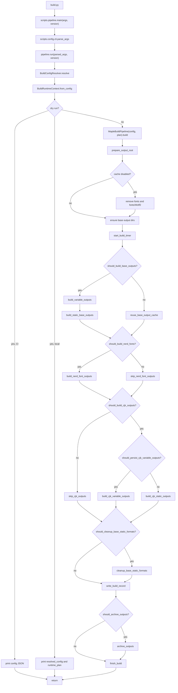
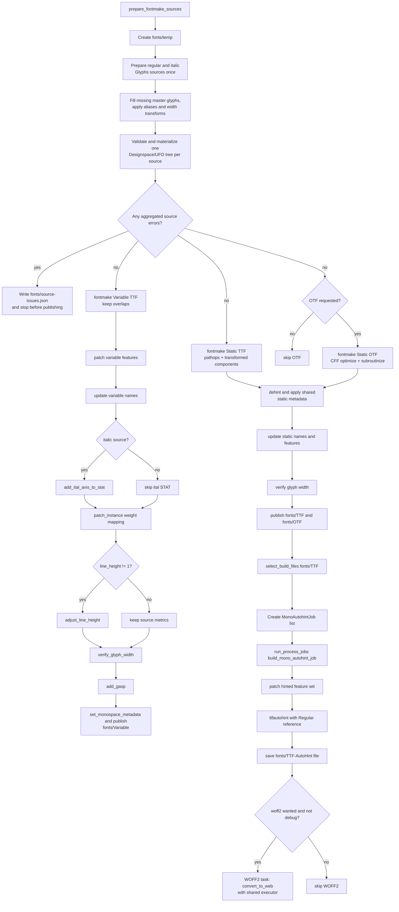
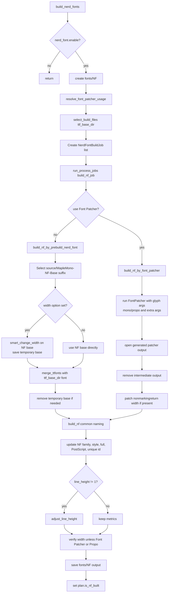
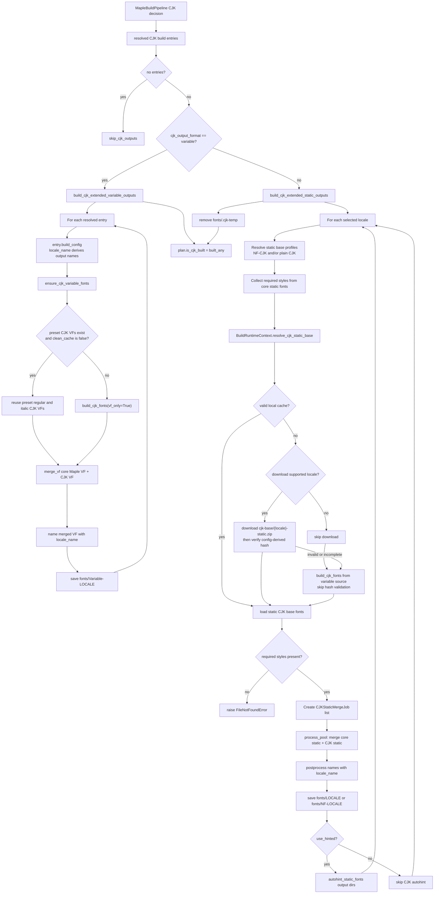
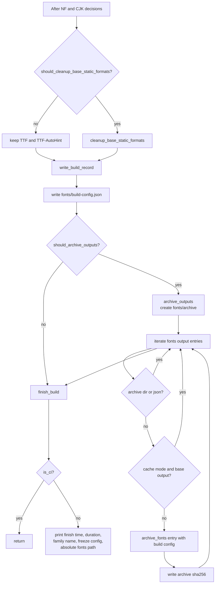

# Maple Mono Build Pipeline

This package contains the Maple Mono build, CJK, OpenType feature, shared font,
and task-runner implementation.

## Architecture

- `MapleBuildPipeline` in `pipeline.py` owns the top-level build flow, output
  lifecycle, cache behavior, archive behavior, and variant sequencing.
- Process-pool tasks run through top-level `*_job` functions with explicit job
  dataclasses so spawn/pickle behavior stays stable across platforms.
- `font_ops/` contains reusable font naming, metrics, OpenType, merge, and glyph transform operations.
- `resolver.py` converts config file and CLI inputs into a resolved build config,
  runtime output paths, and CJK static base resolution decisions.

## Logging

CLI entrypoints configure one `scripts` logger to write `[LEVEL] [task] message`
records to stderr. Top-level task groups are separated by one blank line. Set
`MAPLE_LOG_LEVEL` to `DEBUG`, `INFO`, `WARNING`, `ERROR`, or `CRITICAL` to control
verbosity; the default is `INFO`. `build.py --debug` uses `DEBUG` as the default
for that CLI invocation, while an explicit `MAPLE_LOG_LEVEL` still takes priority.

Machine-readable dry-run output remains on stdout. In particular, CI keeps
`build.py --dry` as JSON-only stdout so it can be piped to tools such as `jq`.
Worker processes configure the same logger before running font jobs.
Downloads with a known content length refresh their percentage and transferred
size on one stderr line instead of emitting one record per chunk.

## Files

| File | Purpose |
| ---- | ------- |
| `config/` | CLI parsing, resolved configuration models, and output path helpers. |
| `pipeline.py` | Public build entrypoint and build orchestration. |
| `resolver.py` | Build configuration and runtime planning. |
| `utils/` | Filesystem, process, download, archive, errors, and version helpers. |
| `font_ops/` | Shared font and glyph operations, transforms, and typed FontTools table boundaries. |
| `cjk/` | CJK data models, JSON/CLI configuration, presets, variable-font operations, and pipeline. |
| `feature/` | Ordered feature catalog, compiler, freeze implementation, and font application. |
| `task/` | Thin task parser and workflow adapters. |

## Pipeline Flow

## Base Font Flow

The precompiled `source/MapleMono[wght]-VF.ttf` and
`source/MapleMono-Italic[wght]-VF.ttf` files are reference artifacts only. The
build always generates fresh variable fonts from the corresponding `.glyphs`
sources and never falls back to those binaries.

## Nerd Font Flow

## CJK Flow

## Finish and Archive Flow

## Design Decisions

| Decision | Rationale |
| -------- | --------- |
| Keep `config.cli` pure and use `pipeline.main(args, version)` as the public entrypoint | Allow CLI parsing to be reused without importing or executing the build pipeline. |
| Keep process-pool workers at module top level | Avoid pickling bound methods, closures, or partials. |
| Use explicit job dataclasses | Make each parallel task's inputs visible and serializable. |
| Reuse one executor across the build lifecycle | Avoid repeatedly starting workers between base, web, Nerd Font, and CJK stages; CFF glyph chunks retain a specialized pool for their custom initializer. |
| Keep build configuration and resolution outside `pipeline.py` | Keep the execution pipeline focused on build orchestration. |
| Resolve CJK static bases in `BuildRuntimeContext` | Keep cache, download, hash, and variable fallback decisions outside the execution pipeline. |

## Main Phases

| Phase | Main owner |
| ----- | ---------- |
| Config and CLI | `cli.py`, `BuildConfigResolver` |
| Runtime orchestration | `MapleBuildPipeline` |
| CJK static base resolution | `BuildRuntimeContext.resolve_cjk_static_base` |
| Fontmake source build | `prepare_fontmake_sources`, `compile_fontmake_format` |
| Base static postprocess | `StaticPostprocessJob`, `postprocess_static_font_job` |
| Autohint output | `MonoAutohintJob`, `build_mono_autohint_job` |
| Web font conversion | `convert_to_web` |
| Nerd Font output | `NerdFontBuildJob`, `build_nf_job` |
| CJK extended output | `build_cjk_extended_outputs` and CJK utilities |
| Build record and archive | `MapleBuildPipeline` |
