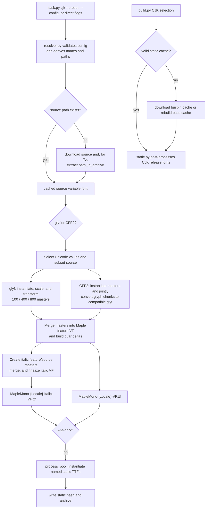

# Maple Mono CJK Build Pipeline

This package builds reusable CJK base fonts and provides the built-in
CN/JP/TC/KR presets. All built-in CJK assets and preset JSON files live under
`source/cjk`. The base build writes regular and italic variable fonts plus a
checked static-font cache; the main `build.py` pipeline consumes that cache to
produce release fonts with the selected Maple options.

## Architecture

- `CJKBuilder` in `builder.py` owns source download, VF generation, static
  base-cache generation, and executor lifecycle.
- `outlines.py` owns glyph command replay and CFF/CFF2-to-glyf conversion.
- `cache.py` validates readable variable-font outputs for local reuse.
- `resolver.py` parses JSON and CLI input, then derives output paths and font
  names from `locale_name`.
- `presets.py` maps preset metadata to `source/cjk/{locale}/config-{locale}.json`.
- Built-in preset behavior is data-driven through JSON configs, not Python
  hard-coded build configs.
- `locale_name` is the only source of truth for generated CJK output layout,
  family names, PostScript prefixes, and temporary paths.
- Process-pool tasks run through top-level worker functions so spawn/pickle
  behavior stays stable across platforms.
- `variable.py` owns shared variable-font and glyph operations; `static.py`
  post-processes CJK static fonts in the main build pipeline.

## Files

| File                  | Purpose                                                                                                 |
| --------------------- | ------------------------------------------------------------------------------------------------------- |
| `config.py`           | CJK dataclasses, Unicode presets, and transform defaults.                                               |
| `resolver.py`         | JSON loading and validation, CLI parsing, direct CLI configuration, and locale-derived paths and names. |
| `builder.py`          | Source download, subsetting, master preparation, VF generation, and static base-cache generation.       |
| `outlines.py`         | Glyph command replay, compatible-master validation, and CFF/CFF2-to-glyf conversion.                    |
| `cache.py`            | Variable-font output validation for local reuse.                                                        |
| `presets.py`          | Built-in CN/JP/TC/KR preset metadata and JSON config loading.                                           |
| `static.py`           | Main-build CJK static-font naming, metrics, metadata, feature, and width post-processing.               |
| `variable.py`         | Shared variable-font loading, glyph merging, `gvar` construction, italic transforms, and table cleanup. |
| `scripts/task/cjk.py` | `task.py cjk` parser registration and preset/custom build dispatch.                                     |

The related main-build integration lives in `scripts/config/base.py` and
`scripts/config/resolver.py`. It selects CJK locales, validates the static
cache, downloads a built-in cache when available, or falls back to building the
base fonts from the configured variable source.

## Asset Layout

| Path                                                       | Purpose                              |
| ---------------------------------------------------------- | ------------------------------------ |
| `source/cjk/cn/config-cn.json`                             | Built-in CN build config.            |
| `source/cjk/jp/config-jp.json`                             | Built-in JP build config.            |
| `source/cjk/tc/config-tc.json`                             | Built-in TC build config.            |
| `source/cjk/kr/config-kr.json`                             | Built-in KR build config.            |
| `source/cjk/variable-source/MapleMono-CJK-Base-VF.ttf`     | Feature and metadata source font.    |
| `source/cjk/variable-source/WenYuanRoundedSCVF.ttf`        | CN source variable font.             |
| `source/cjk/variable-source/ResourceHanRoundedJP-VF.otf`   | JP source variable font.             |
| `source/cjk/variable-source/ChironGoRoundTCVF.ttf`         | TC/KR source variable font.          |
| `source/cjk/{locale}/MapleMono-{Locale}-VF.ttf`            | Generated regular CJK variable base. |
| `source/cjk/{locale}/MapleMono-{Locale}-Italic-VF.ttf`     | Generated italic CJK variable base.  |
| `source/cjk/{locale}/static/MapleMono{Locale}-{Style}.ttf` | Generated static CJK bases.          |
| `source/cjk/{locale}/static-{locale}.sha256`               | Static CJK base hash.                |

`locale_name` is a compact ASCII suffix such as `CN`, `JP`, `TC`, or `KR`.
For example, `locale_name: "CN"` derives `source/cjk/cn`,
`MapleMono-CN-VF.ttf`, `MapleMono-CN-Italic-VF.ttf`, `Maple Mono CN`,
`MapleMonoCN`, `static-cn.sha256`, `cn-base-static.zip`, and
`source/cjk/cn/temp`. These derived values are not configurable from JSON or
CLI flags.

The only JSON-configurable top-level fields are `locale_name`, `source`,
`unicode`, and `transform`. `feature_font`, `output`, `naming`, `temp_dir`,
and `outline_mode` are intentionally unsupported. The builder always uses the
project feature font and detects the source outline format; the source must be
a variable font with exactly one of `glyf` or `CFF2` outlines.

Each `source` may define an optional `download` object. A build reuses
`source.path` when it already exists; otherwise it downloads `download.url` to
a temporary sibling and atomically installs the selected font at `source.path`.
For a 7z URL, set `download.path_in_archive` to the exact file path relative to
the archive root. The archive format is detected from its content. Config
parsing and dry runs never download source fonts.

GitHub downloads use the root `github_mirror` setting. The `GITHUB` environment
variable takes precedence for both `build.py` and `task.py`; release and raw
GitHub URLs are resolved by the shared download utility before each request.

## Configuration Guide

A custom config only needs a locale label, a variable-font path, and three
source weight locations:

```json
{
  "$schema": "./cjk_schema.json",
  "locale_name": "HK",
  "source": {
    "path": "MyCJK-VF.ttf",
    "masters": {
      "100": { "wght": 200 },
      "400": { "wght": 400 },
      "800": { "wght": 900 }
    }
  }
}
```

To populate the local cache from a 7z archive, add:

```json
"download": {
  "url": "https://example.com/MyCJK-VF.7z",
  "path_in_archive": "fonts/MyCJK-VF.otf"
}
```

Use `/` separators in `path_in_archive`. Omit it when `url` points directly to
the font file.

The builder detects `glyf` or `CFF2` outlines automatically. It also derives
the family name, PostScript name, output file names, and cache directories from
`locale_name`; users and agents should not invent professional font names.

| Term          | Configuration meaning                                                                                                |
| ------------- | -------------------------------------------------------------------------------------------------------------------- |
| master        | One source variable-font position used for Maple's 100, 400, or 800 weight.                                          |
| axis tag      | A source-font control such as `wght` (weight) or `ROND` (roundness). Read these from the source font's `fvar` table. |
| `drop_tables` | Advanced OpenType cleanup. Omit it unless a source table conflicts with merging.                                     |
| Unicode range | Characters to import, for example `0x4E00-0x9FFF`. Omit ranges to use the CJK defaults.                              |
| transform     | Optional scale and movement corrections. Omit it when the source already aligns correctly.                           |

## Commands

Build a built-in CJK base cache:

```sh
uv run task.py cjk --preset cn
uv run task.py cjk --preset jp
```

Build from a JSON config or rebuild only the regular and italic variable bases:

```sh
uv run task.py cjk --config source/cjk/tc/config-tc.json
uv run task.py cjk --preset kr --vf-only
```

Build a custom source directly. Repeat `--axis` for fixed source-axis
coordinates; use `--wght-min`, `--wght-regular`, and `--wght-max` to override
the source weight coordinates when necessary:

```sh
uv run task.py cjk --source MyCJK-VF.ttf --locale-name HK --axis ROND=100
```

`--unicodes` accepts a built-in Unicode preset (`cn`, `jp`, `tc`, or `kr`) or a
pyftsubset-style range expression. The command also supports source table,
encoding, width, scale, translation, and italic-angle overrides. Run the
following command to inspect the current complete argument list:

```sh
uv run task.py cjk --help
```

## Data Flow



## Built-in Presets

| Preset | Config                         | Source                                                   | Auto-detected result | Output          |
| ------ | ------------------------------ | -------------------------------------------------------- | -------------------- | --------------- |
| CN     | `source/cjk/cn/config-cn.json` | `source/cjk/variable-source/WenYuanRoundedSCVF.ttf`      | glyf                 | `source/cjk/cn` |
| JP     | `source/cjk/jp/config-jp.json` | `source/cjk/variable-source/ResourceHanRoundedJP-VF.otf` | CFF2                 | `source/cjk/jp` |
| TC     | `source/cjk/tc/config-tc.json` | `source/cjk/variable-source/ChironGoRoundTCVF.ttf`       | glyf                 | `source/cjk/tc` |
| KR     | `source/cjk/kr/config-kr.json` | `source/cjk/variable-source/ChironGoRoundTCVF.ttf`       | glyf                 | `source/cjk/kr` |

Each output directory contains regular and italic variable bases, `static/`
named TTF instances, `static-{locale}.sha256`, and a
`{locale}-base-static.zip` archive. They are generated artifacts; do not edit
them manually. Local variable-font reuse only checks that both variable TTFs
are readable; use `--clean-cache` to force regeneration after changing inputs
or build settings. `static-{locale}.sha256` remains the integrity checksum for
the generated static directory and is used when downloading or reusing a
static CJK base.

## Design Decisions

| Decision                                                                           | Rationale                                                                                                 |
| ---------------------------------------------------------------------------------- | --------------------------------------------------------------------------------------------------------- |
| Keep all built-in CJK assets under `source/cjk`                                    | Avoid locale-specific source roots and make preset configs portable.                                      |
| Store built-in presets as JSON                                                     | Keep source paths, ranges, masters, Unicode filters, and transforms visible without changing Python code. |
| Cache downloaded source fonts at `source.path`                                     | Make repeated builds deterministic and avoid downloading large CJK assets when already available.         |
| Derive naming and outputs from `locale_name`                                       | Prevent drift between JSON config, generated paths, and font names.                                       |
| Never allow incompatible glyphs                                                    | Fail early when source and feature glyph geometry cannot be merged safely.                                |
| Keep `source/cjk/variable-source/MapleMono-CJK-Base-VF.ttf` as the metadata source | Reuse weight axis names, static instance names, and feature glyphs consistently.                          |
| Subset before instantiating masters                                                | Avoid expensive work for glyphs that will be discarded.                                                   |
| Convert CFF2 sources to TTF masters early                                          | Keep the regular/italic merge path shared.                                                                |
| Convert CFF masters by glyph chunks                                                | Joint `cu2qu` keeps masters compatible while process-pool chunks keep large subsets fast.                 |
| Resolve static bases before the main build                                         | Reuse a valid local cache, then a release download for built-in locales, before rebuilding source fonts.  |
| Always emit variable and static fonts as TTF                                       | CFF2 source outlines are converted to compatible `glyf` masters during source master preparation.         |

## Main Phases

| Phase                        | Main functions                                                                                           |
| ---------------------------- | -------------------------------------------------------------------------------------------------------- |
| Config and CLI               | `config_from_json`, `config_from_cli`, `apply_cli_overrides`, `add_cjk_arguments`, `build_preset_config` |
| Unicode selection            | `unicode_config_from_spec`, `get_allowed_codepoints`                                                     |
| Subsetting                   | `prepare_source_subset`                                                                                  |
| Master instantiation         | `prepare_source_masters`, `instantiate_masters_from_vf`                                                  |
| glyf merge                   | `merge_masters_into_vf`                                                                                  |
| CFF2 conversion              | `convert_cff_static_to_glyf`, `update_maxp_for_glyf`                                                     |
| Italic build                 | `make_italic_variable_font`, `make_italic_master_file`                                                   |
| Static output                | `CJKBuilder._build_static_fonts`, `instantiate_static_font_file`                                         |
| Main-build static processing | `postprocess_cjk_extended_static_font`                                                                   |
| Final cleanup                | `finalize_variable_font`, `finalize_static_font_instance`, `build_cjk_fonts`                             |

## Validation

Start with the smallest relevant checks for CJK configuration or pipeline
changes:

```sh
uv run task.py cjk --help
uv run build.py --dry
uv run python -m unittest scripts.tests.test_cjk_config
uv run python -m unittest scripts.tests.test_cjk_executor
```

Avoid a full CJK build unless required: it may download large source assets and
take substantial time. The generated CJK cache and `fonts/` outputs are build
artifacts, not hand-edited sources.
