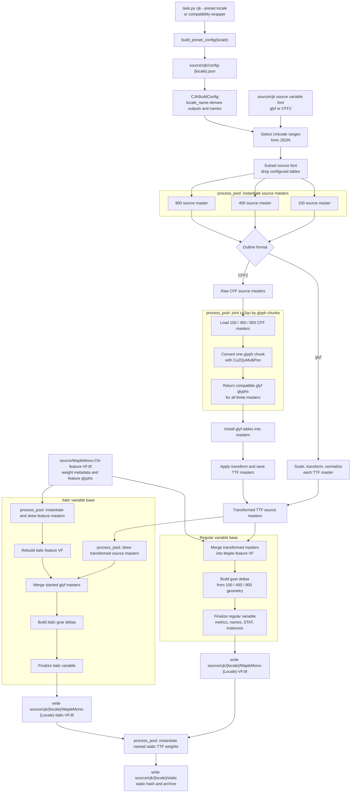

# Maple Mono CJK Build Pipeline

This package contains the shared CJK build pipeline and the built-in
CN/JP/TC/KR presets. All built-in CJK assets and preset JSON files live under
`source/cjk`.

## Architecture

- `CJKBuilder` in `builder.py` owns the top-level build flow, path planning, and
  executor lifecycle.
- `presets.py` only maps preset metadata to `source/cjk/config-{locale}.json`.
- Built-in preset behavior is data-driven through JSON configs, not Python
  hard-coded build configs.
- `locale_name` is the only source of truth for generated CJK output layout,
  family names, PostScript prefixes, and temporary paths.
- Process-pool tasks run through top-level worker functions so spawn/pickle
  behavior stays stable across platforms.
- Worker-local state is explicitly grouped as cache containers instead of loose
  module globals.

## Files

| File | Purpose |
| ---- | ------- |
| `config.py` | Shared dataclasses, Unicode presets, JSON loading, and CLI argument parsing. |
| `builder.py` | Shared configurable CJK build pipeline and build entrypoints. |
| `presets.py` | Built-in CN/JP/TC/KR preset metadata and JSON config loading. |
| `cn.py`, `jp.py`, `tc.py`, `kr.py` | Compatibility wrappers that call the JSON-backed preset pipeline. |
| `verify_cff_to_glyf.py` | Fast verifier that contrasts independent cu2qu against joint multi-master conversion on a temporary tiny subset. |
| `vf.py` | Shared variable-font, master-merge, and italic helper logic. |

## Asset Layout

| Path | Purpose |
| ---- | ------- |
| `source/cjk/config-cn.json` | Built-in CN build config. |
| `source/cjk/config-jp.json` | Built-in JP build config. |
| `source/cjk/config-tc.json` | Built-in TC build config. |
| `source/cjk/config-kr.json` | Built-in KR build config. |
| `source/cjk/WenYuanRoundedSCVF.ttf` | CN source variable font. |
| `source/cjk/ResourceHanRoundedJP-VF.otf` | JP source variable font. |
| `source/cjk/ChironGoRoundTCVF.ttf` | TC/KR source variable font. |
| `source/cjk/{locale}/MapleMono-{Locale}-VF.ttf` | Generated regular CJK variable base. |
| `source/cjk/{locale}/MapleMono-{Locale}-Italic-VF.ttf` | Generated italic CJK variable base. |
| `source/cjk/{locale}/static/MapleMono{Locale}-{Style}.ttf` | Generated static CJK bases. |
| `source/cjk/{locale}/static-{locale}.sha256` | Static CJK base hash. |

`locale_name` is a compact ASCII suffix such as `CN`, `JP`, `TC`, or `KR`.
For example, `locale_name: "CN"` derives `source/cjk/cn`,
`MapleMono-CN-VF.ttf`, `Maple Mono CN`, `MapleMonoCN`, and
`source/cjk/cn/temp`. These derived values are not configurable from JSON or
CLI flags.

## Data Flow

## Built-in Presets

| Preset | Config | Source | Outline | Output |
| ------ | ------ | ------ | ------- | ------ |
| CN | `source/cjk/config-cn.json` | `source/cjk/WenYuanRoundedSCVF.ttf` | glyf | `source/cjk/cn` |
| JP | `source/cjk/config-jp.json` | `source/cjk/ResourceHanRoundedJP-VF.otf` | CFF2 | `source/cjk/jp` |
| TC | `source/cjk/config-tc.json` | `source/cjk/ChironGoRoundTCVF.ttf` | CFF2 | `source/cjk/tc` |
| KR | `source/cjk/config-kr.json` | `source/cjk/ChironGoRoundTCVF.ttf` | CFF2 | `source/cjk/kr` |

## Design Decisions

| Decision | Rationale |
| -------- | --------- |
| Keep all built-in CJK assets under `source/cjk` | Avoid locale-specific source roots and make preset configs portable. |
| Store built-in presets as JSON | Keep source paths, ranges, masters, Unicode filters, and transforms visible without changing Python code. |
| Derive naming and outputs from `locale_name` | Prevent drift between JSON config, generated paths, and font names. |
| Never allow incompatible glyphs | Fail early when source and feature glyph geometry cannot be merged safely. |
| Keep `MapleMono-CN-feature-VF.ttf` as the metadata source | Reuse weight axis names, static instance names, and feature glyphs consistently. |
| Subset before instantiating masters | Avoid expensive work for glyphs that will be discarded. |
| Convert CFF2 sources to TTF masters early | Keep the regular/italic merge path shared. |
| Convert CFF masters by glyph chunks | Joint `cu2qu` keeps masters compatible while process-pool chunks keep large subsets fast. |
| Always emit variable and static fonts as TTF | CFF2 source outlines are converted to compatible `glyf` masters during source master preparation. |

## Main Phases

| Phase | Main functions |
| ----- | -------------- |
| Config and CLI | `config_from_json`, `config_from_cli`, `add_cjk_arguments`, `build_preset_config` |
| Unicode selection | `unicode_config_from_spec`, `get_allowed_codepoints` |
| Subsetting | `prepare_source_subset`, `subset_font` |
| Master instantiation | `prepare_source_masters`, `instantiate_masters_from_vf` |
| glyf merge | `merge_cjk_masters_into_vf`, `merge_masters_into_vf` |
| CFF2 conversion | `convert_cff_static_to_glyf`, `update_maxp_for_glyf` |
| Italic build | `make_italic_variable_font`, `make_italic_master_file` |
| Static output | `instantiate_static_fonts`, `instantiate_static_font_file` |
| Final cleanup | `finalize_variable_font`, `write_static_hash`, `archive_static_fonts` |
