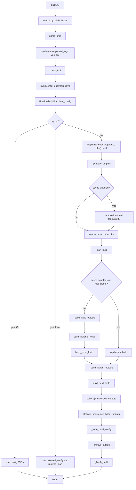
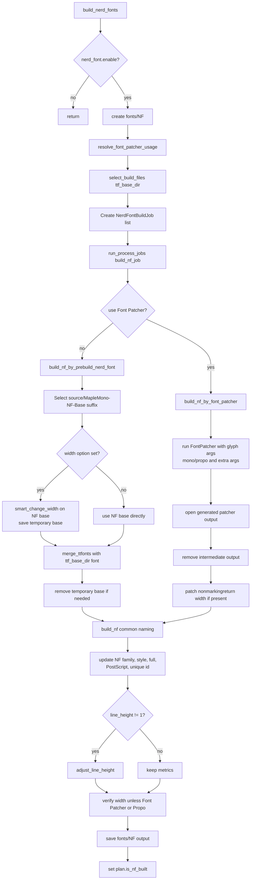
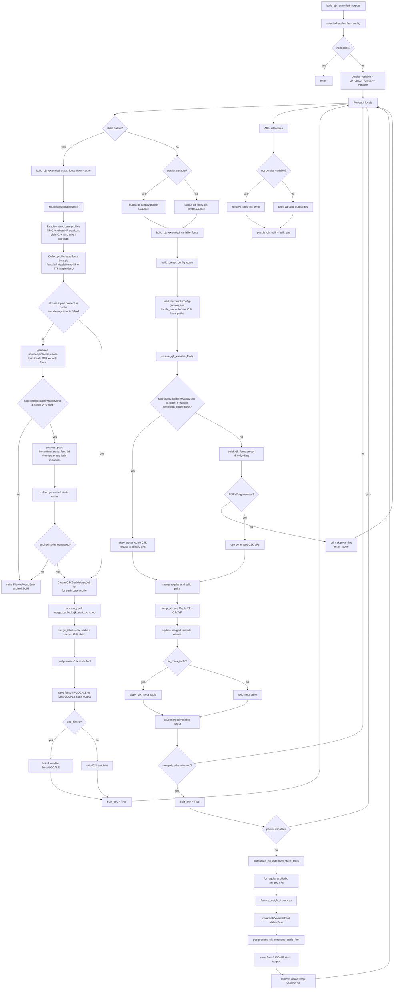
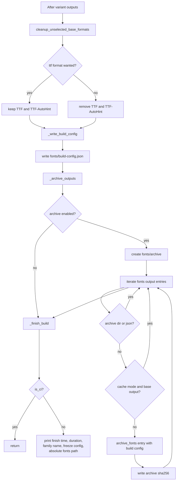

# Maple Mono Build Pipeline

This package contains the top-level Maple Mono build pipeline, CLI config
resolution, runtime path planning, and shared build helpers.

## Architecture

- `MapleBuildPipeline` in `pipeline.py` owns the top-level build flow, output
  lifecycle, cache behavior, archive behavior, and variant sequencing.
- Process-pool tasks run through top-level `*_job` functions with explicit job
  dataclasses so spawn/pickle behavior stays stable across platforms.
- `util.py` contains helper functions that do not own the pipeline lifecycle,
  including font naming, CJK post-processing, and style/path selection helpers.
- `resolver.py` converts config file and CLI inputs into a resolved build config
  plus runtime output paths.

## Files

| File | Purpose |
| ---- | ------- |
| `cli.py` | CLI entrypoint and argument parsing for `build.py`. |
| `config.py` | Build dataclasses, defaults, normalization, and serialization helpers. |
| `paths.py` | Shared output path and merged variable filename helpers. |
| `pipeline.py` | Main Maple Mono build pipeline, process-pool jobs, and public `main` entrypoint. |
| `resolver.py` | Config-file and CLI override resolution into runtime-ready settings. |
| `util.py` | Pure/helper build functions shared by pipeline phases. |

## Pipeline Flow

## Base Font Flow

```mermaid
flowchart TD
    A["build_variable_fonts"] --> B["Open source variable fonts<br/>MapleMono[wght]-VF.ttf<br/>MapleMono-Italic[wght]-VF.ttf"]
    B --> C["rename_glyph_name<br/>using .glyphs mapping"]
    C --> D["alias_codepoints"]
    D --> E{"width option set?"}
    E -->|"yes"| F["smart_change_width"]
    E -->|"no"| G["skip width transform"]
    F --> H["patch variable features"]
    G --> H
    H --> I["update variable names"]
    I --> J{"italic source?"}
    J -->|"yes"| K["add_ital_axis_to_stat"]
    J -->|"no"| L["skip ital STAT"]
    K --> M["patch_instance weight mapping"]
    L --> M
    M --> N{"line_height != 1?"}
    N -->|"yes"| O["adjust_line_height"]
    N -->|"no"| P["keep source metrics"]
    O --> Q["verify_glyph_width"]
    P --> Q
    Q --> R["add_gasp"]
    R --> S["save fonts/Variable family VF"]
    S --> T["ftcli fix monospace fonts/Variable"]
    T --> U["instantiate_base_static_fonts"]

    U --> V["Read named wght instances<br/>from regular variable font"]
    V --> W["Create MapleStaticInstanceJob<br/>for regular and italic VFs"]
    W --> X["create_font_executor"]
    X --> Y["top-level worker<br/>instantiate_maple_static_font_job"]
    Y --> Z["get_static_worker_font cache"]
    Z --> AA["instantiateVariableFont static=True"]
    AA --> AB["save fonts/TTF raw static fonts"]

    AB --> AC["build_base_fonts"]
    AC --> AD["select_build_files fonts/TTF"]
    AD --> AE["Create MonoBuildJob list"]
    AE --> AF["run_process_jobs build_mono_job"]
    AF --> AG["ftcli fix italic-angle, monospace,<br/>strip names, correct contours,<br/>dehint, transformed components"]
    AG --> AH["update static names and features"]
    AH --> AI["verify glyph width"]
    AI --> AJ["save final fonts/TTF file"]
    AJ --> AK{"woff2 wanted and not debug?"}
    AK -->|"yes"| AL["ftcli converter ft2wf"]
    AK -->|"no"| AM["skip WOFF2"]
    AL --> AN{"otf wanted and not debug?"}
    AM --> AN
    AN -->|"yes"| AO["ftcli ttf2otf<br/>correct contours<br/>cff set-names"]
    AN -->|"no"| AP["skip OTF"]

    AP --> AQ["select_build_files fonts/TTF"]
    AQ --> AR["Create MonoAutohintJob list"]
    AR --> AS["run_process_jobs build_mono_autohint_job"]
    AS --> AT["patch hinted feature set"]
    AT --> AU["ttfautohint with Regular reference"]
    AU --> AV["save fonts/TTF-AutoHint file"]
```

## Nerd Font Flow

## CJK Flow

## Finish and Archive Flow

## Design Decisions

| Decision | Rationale |
| -------- | --------- |
| Keep the public `pipeline.main(parsed_args, version)` entrypoint | Preserve compatibility with `source.py.build.cli` and `build.py`. |
| Keep process-pool workers at module top level | Avoid pickling bound methods, closures, or partials. |
| Use explicit job dataclasses | Make each parallel task's inputs visible and serializable. |
| Keep helper logic in `util.py` | Reduce pipeline size while keeping lifecycle and worker code in one place. |
| Reuse cached static CJK bases when possible | Avoid unnecessary variable CJK merge work for static-only CJK builds. |

## Main Phases

| Phase | Main owner |
| ----- | ---------- |
| Config and CLI | `cli.py`, `BuildConfigResolver` |
| Runtime orchestration | `MapleBuildPipeline` |
| Variable font build | `build_variable_fonts` |
| Static TTF instantiation | `MapleStaticInstanceJob`, `instantiate_maple_static_font_job` |
| Base TTF postprocess | `MonoBuildJob`, `build_mono_job` |
| Autohint output | `MonoAutohintJob`, `build_mono_autohint_job` |
| Nerd Font output | `NerdFontBuildJob`, `build_nf_job` |
| CJK extended output | `build_cjk_extended_outputs` and CJK utilities |
| Build record and archive | `MapleBuildPipeline` |
