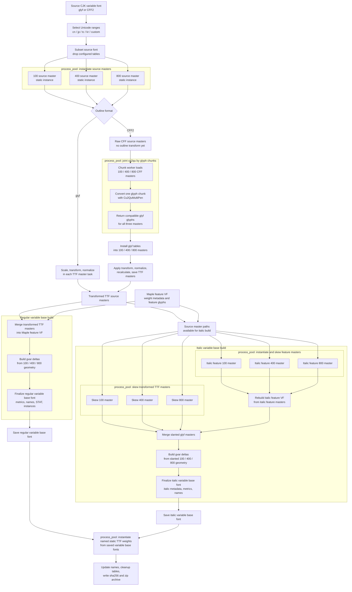

# Maple Mono CJK Build Pipeline

This package contains the shared CJK build pipeline and the built-in CN/JP
presets.

## Files

| File | Purpose |
| ---- | ------- |
| `config.py` | Shared dataclasses, Unicode presets, JSON loading, and CLI argument parsing. |
| `builder.py` | Shared configurable CJK build pipeline and build entrypoints. |
| `cn.py` | Built-in CN preset using `source/cn/WenYuanRoundedSCVF.otf`. |
| `jp.py` | Built-in JP preset using `source/jp/ResourceHanRoundedJP-VF.otf`. |
| `verify_cff_to_glyf.py` | Fast verifier that contrasts independent cu2qu against joint multi-master conversion on a temporary tiny subset. |
| `vf.py` | Shared variable-font, master-merge, and italic helper logic. |

## Data Flow



## Master Mapping

`CJKSourceConfig.masters` is keyed by output weights:

```json
{
  "100": { "wght": 220, "ital": 0 },
  "400": { "wght": 470, "ital": 0 },
  "800": { "wght": 900, "ital": 0 }
}
```

The keys are Maple Mono output weights. The values are source-font axis
locations. This lets the pipeline map source geometry directly onto
`source/MapleMono-CN-feature-VF.ttf`, which remains the source of truth for
weight axis metadata and named static instances.

## Design Decisions

| Decision | Rationale |
| -------- | --------- |
| Subset before instantiating masters | Avoid expensive work for glyphs that will be discarded. |
| Keep `MapleMono-CN-feature-VF.ttf` as the metadata source | Reuse weight axis names, static instance names, and feature glyphs consistently. |
| Use a glyf master-merge path for glyf sources | Static masters provide `glyf`/`hmtx`; the pipeline computes `gvar` deltas for added glyphs. |
| Convert CFF2 sources to TTF masters early | Avoid rebuilding CFF2 variable fonts and keep the regular/italic merge path shared. |
| Convert CFF masters by glyph chunks | Joint `cu2qu` keeps masters compatible while process-pool chunks keep large subsets fast. |
| Always emit variable and static fonts as TTF | CFF2 source outlines are converted to compatible `glyf` masters during source master preparation. |
| Keep built-in presets thin | CN and JP presets only define source paths, master mappings, Unicode filters, naming, and output layout. |

## Built-in Presets

| Preset | Source | Outline | Notes |
| ------ | ------ | ------- | ----- |
| CN | `source/cn/WenYuanRoundedSCVF.otf` | glyf | Merges source masters into the Maple feature VF and emits CN variable/static outputs. |
| JP | `source/jp/ResourceHanRoundedJP-VF.otf` | CFF2 | Converts source masters to TTF, then uses the shared glyf variable/static pipeline. |

## Main Phases

| Phase | Main functions |
| ----- | -------------- |
| Config and CLI | `config_from_json`, `config_from_cli`, `add_cjk_arguments` |
| Unicode selection | `unicode_config_from_spec`, `get_allowed_codepoints` |
| Subsetting | `prepare_source_subset`, `subset_font` |
| Master instantiation | `prepare_source_masters`, `instantiate_masters_from_vf` |
| glyf merge | `merge_cjk_masters_into_vf`, `merge_masters_into_vf` |
| CFF2 conversion | `convert_cff_static_to_glyf`, `update_maxp_for_glyf` |
| Italic build | `make_italic_variable_font`, `make_italic_master_file` |
| Static output | `instantiate_static_fonts`, `convert_cff_static_to_glyf` |
| Final cleanup | `finalize_variable_font`, `instantiate_static_font_file` |
