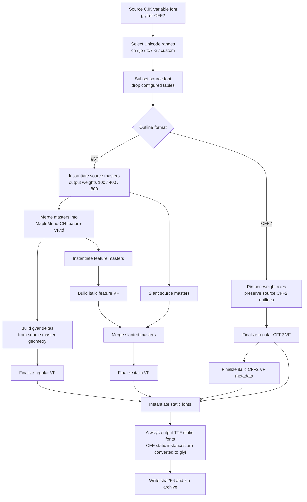

# Maple Mono CJK Build Pipeline

This package contains the shared CJK build pipeline and the built-in CN/JP
presets.

## Files

| File | Purpose |
| ---- | ------- |
| `builder.py` | Shared configurable CJK build pipeline and CLI argument handling. |
| `cn.py` | Built-in CN preset using `source/cn/WenYuanRoundedSCVF.ttf`. |
| `jp.py` | Built-in JP preset using `source/jp/ResourceHanRoundedJP-VF.otf`. |
| `vf.py` | Shared variable-font, master-merge, and italic helper logic. |

## Data Flow



## Master Mapping

`CJKSourceConfig.masters` is keyed by output weights:

```json
{
  "100": { "wght": 220, "ital": 0 },
  "400": { "wght": 470, "ital": 0 },
  "800": { "wght": 900, "ital": 0 }
}
```

The keys are Maple Mono output weights. The values are source-font axis
locations. This lets the pipeline map source geometry directly onto
`source/MapleMono-CN-feature-VF.ttf`, which remains the source of truth for
weight axis metadata and named static instances.

## Design Decisions

| Decision | Rationale |
| -------- | --------- |
| Subset before instantiating masters | Avoid expensive work for glyphs that will be discarded. |
| Keep `MapleMono-CN-feature-VF.ttf` as the metadata source | Reuse weight axis names, static instance names, and feature glyphs consistently. |
| Use a glyf master-merge path for glyf sources | Static masters provide `glyf`/`hmtx`; the pipeline computes `gvar` deltas for added glyphs. |
| Preserve CFF2 variable output for CFF2 sources | Avoid converting variable CFF2 outlines before static instantiation. |
| Always emit static fonts as TTF | Static CFF instances are converted to `glyf` before saving. |
| Keep built-in presets thin | CN and JP presets only define source paths, master mappings, Unicode filters, naming, and output layout. |

## Built-in Presets

| Preset | Source | Outline | Notes |
| ------ | ------ | ------- | ----- |
| CN | `source/cn/WenYuanRoundedSCVF.ttf` | glyf | Merges source masters into the Maple feature VF and emits CN variable/static outputs. |
| JP | `source/jp/ResourceHanRoundedJP-VF.otf` | CFF2 | Keeps CFF2 variable output; static fonts are instantiated and converted to TTF. |

## Main Phases

| Phase | Main functions |
| ----- | -------------- |
| Unicode selection | `unicode_config_from_spec`, `get_allowed_codepoints` |
| Subsetting | `prepare_source_subset`, `subset_font` |
| Master instantiation | `instantiate_masters_from_vf`, `build_master_locations` |
| glyf merge | `merge_cjk_masters_into_vf`, `merge_masters_into_vf` |
| CFF2 variable build | `build_cff2_cjk_fonts`, `cff2_variable_axis_limits` |
| Italic build | `make_italic_variable_font`, `make_italic_master_file` |
| Static output | `instantiate_static_fonts`, `convert_cff_static_to_glyf` |
| Final cleanup | `finalize_variable_font`, `finalize_cff2_variable_font`, `cleanup_static_font_file` |
