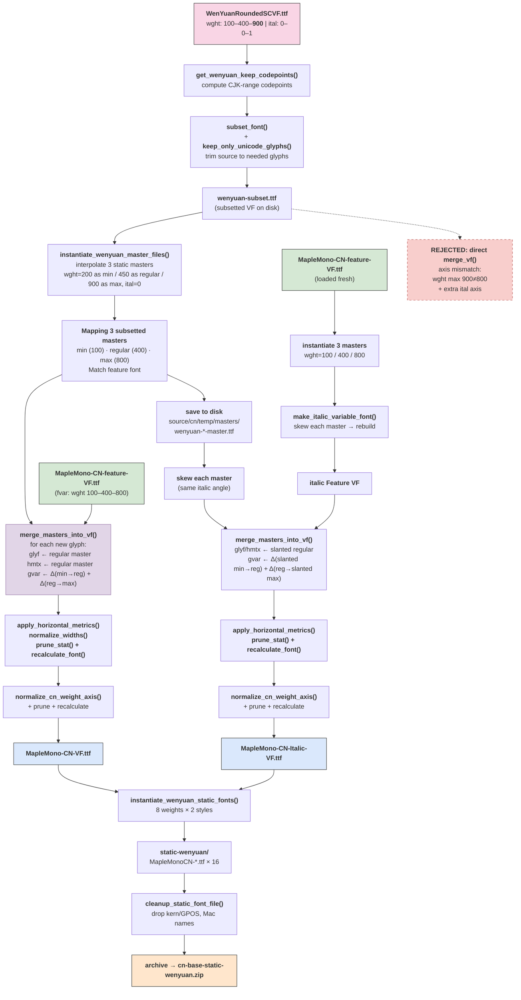

# Maple Mono CN WenYuan Build Pipeline

## Key design decisions

| Decision                                             | Rationale                                                                                                                                                                                                                      |
| ---------------------------------------------------- | ------------------------------------------------------------------------------------------------------------------------------------------------------------------------------------------------------------------------------ |
| **Subset source first**                              | Avoid instantiating masters with CJK glyphs that will be discarded later                                                                                                                                                       |
| **Merge masters → feature font directly**            | Static masters carry `glyf`/`hmtx` at 3 weights; `gvar` deltas computed inline during merge. No intermediate WenYuan VF — `load_wenyuan_template` + `rebuild_weight_masters_with_regular_default` eliminated from regular path |
| **Reuse subsetted masters for italic**               | The 3 saved masters are mechanically slanted, then merged directly into the italic feature VF via `merge_masters_into_vf` — same pattern as regular path, no intermediate italic WenYuan VF                                    |
| **Feature font loaded fresh per merge**              | It is small (`MapleMono-CN-feature-VF.ttf`); loading twice is cheaper than deep-copying                                                                                                                                        |
| **Feature font made italic before italic merge**     | Feature font is slanted via `make_italic_variable_font`; then slanted WenYuan masters are merged directly into it — same `merge_masters_into_vf` as regular path                                                               |
| **`normalize_cn_weight_axis` only on merged result** | Feature font's `fvar` is the target; wenyuan `gvar` is written in normalized coords (−1…1)                                                                                                                                     |
| **Zero glyph overlap**                               | Feature (Maple Mono specific glyphs) and WenYuan (CJK) are disjoint → merge is purely additive                                                                                                                                 |

## Functions by phase

| Phase               | Functions                                                                        |
| ------------------- | -------------------------------------------------------------------------------- |
| Subset              | `get_wenyuan_keep_codepoints`, `subset_font`, `keep_only_unicode_glyphs`         |
| Instantiate masters | `instantiate_wenyuan_master_files`, `instantiate_variable_font_file`             |
| Merge masters → VF  | `merge_masters_into_vf` (new: copies glyf/hmtx + builds gvar per glyph)          |
| Post-process        | `apply_horizontal_metrics`, `normalize_widths`, `prune_stat`, `recalculate_font` |
| Italic (WenYuan)    | skew saved masters → `merge_masters_into_vf` (same as regular path)              |
| Italic (Feature)    | instantiate 3 masters → `make_italic_variable_font`                              |
| Finalize            | `normalize_cn_weight_axis` (feature font's `fvar` is the target)                 |
| Static output       | `instantiate_wenyuan_static_fonts`, `cleanup_static_font_file`                   |
